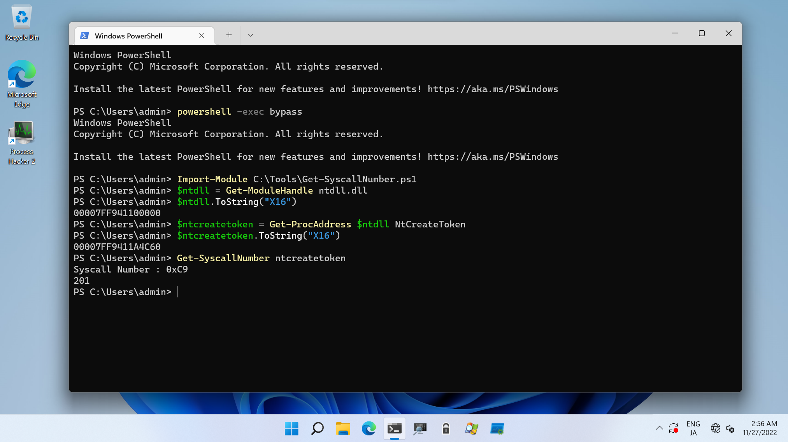

# AtomicSyscall
Tools and PoCs for Windows syscall investigation.


## Table Of Contents

- [AtomicSyscall](#atomicsyscall)
  - [HeavensGate](#heavensgate)
  - [SyscallDumper](#syscalldumper)
  - [SyscallPoCs](#syscallpocs)
  - [SyscallResolvers](#syscallresolvers)
  - [Get-SyscallNumber.ps1](#get-syscallnumberps1)
  - [Reference](#reference)
  - [Acknowledgments](#acknowledgments)

## HeavensGate

This directory is for Heaven's Gate technique.
See [README.md](./HeavensGate/README.md)


## SyscallDumper

[Back to Top](#atomicsyscall)

[Project](./SyscallDumper)

This tool is to dump Windows syscall from `ntdll.dll` or `win32u.dll`:

```
C:\Tools>SyscallDumper.exe -h

SyscallDumper - Tool to dump syscall.

Usage: SyscallDumper.exe [Options] [INPUT_DLL_1] [INPUT_DLL_2]

        -h, --help   : Displays this help message.
        -d, --dump   : Flag to dump syscall from ntdll.dll or win32u.dll.
        -D, --diff   : Flag to take diff between 2 dlls.
        -f, --format : Specifies output format. "c" for C/C++, "cs" for CSharp, "py" for Python.
        -n, --number : Specifies syscall number to lookup in decimal or hex format.
        -o, --output : Specifies output file (e.g. "-o result.txt").
        -s, --search : Specifies search filter (e.g. "-s createfile").
        INPUT_DLL_1  : Specifies path of ntdll.dll or win32u.dll. Older one in diffing.
        INPUT_DLL_2  : Specifies path of ntdll.dll or win32u.dll. Newer one in diffing.
```

To dump syscall numbers from ntdll.dll or win32u.dll, use `-d` (`--dump`) option.
If you don't specifies source DLL, this tool dumps syscall numbers from `C:\Windows\System32\ntdll.dll` and `C:\Windows\System32\win32u.dll`:

```
C:\Tools>SyscallDumper.exe -d

[*] No target is specified.
[>] Dumping from system default ntdll.dll and win32u.dll.
[>] Loading C:\Windows\System32\ntdll.dll.
[+] C:\Windows\System32\ntdll.dll is loaded successfully.
    [*] Architecture : AMD64
    [*] Image Name   : ntdll.dll
[+] Got 463 syscall(s).
[>] Loading C:\Windows\System32\win32u.dll.
[+] C:\Windows\System32\win32u.dll is loaded successfully.
    [*] Architecture : AMD64
    [*] Image Name   : win32u.dll
[+] Got 1258 syscall(s).

[Syscall Table from C:\Windows\System32\ntdll.dll]

---------------------------------------------------------------------------------
| Syscall Name                                          | Number | Number (hex) |
---------------------------------------------------------------------------------
| NtAcceptConnectPort                                   | 2      | 0x0002       |
| NtAccessCheck                                         | 0      | 0x0000       |

--snip--

| NtWriteVirtualMemory                                  | 58     | 0x003A       |
| NtYieldExecution                                      | 70     | 0x0046       |
---------------------------------------------------------------------------------

[*] Found 463 syscall(s).


[Syscall Table from C:\Windows\System32\win32u.dll]

-----------------------------------------------------------------------------------
| Syscall Name                                            | Number | Number (hex) |
-----------------------------------------------------------------------------------
| NtBindCompositionSurface                                | 4373   | 0x1115       |
| NtCloseCompositionInputSink                             | 4374   | 0x1116       |

--snip--

| NtValidateCompositionSurfaceHandle                      | 5350   | 0x14E6       |
| NtVisualCaptureBits                                     | 5351   | 0x14E7       |
-----------------------------------------------------------------------------------

[*] Found 1258 syscall(s).
```

If you want to filter syscall name from dump result, use `-s` (`--search`) option.
And you can save result to a file with `-o` (`--output`) option as follows:

```
C:\Tools>SyscallDumper.exe -d C:\SyscallSamples\1809x64\ntdll.dll -s token -o result.txt

[>] Loading C:\SyscallSamples\1809x64\ntdll.dll.
[+] C:\SyscallSamples\1809x64\ntdll.dll is loaded successfully.
    [*] Architecture : AMD64
    [*] Image Name   : ntdll.dll
[+] Got 462 syscall(s).
[>] Trying to save results.
    [*] Output File Path : c:\Tools\result.txt
[+] Results are saved successfully.

c:\Tools>type result.txt
[Syscall Table from C:\SyscallSamples\1809x64\ntdll.dll]

--------------------------------------------------------------
| Syscall Name                       | Number | Number (hex) |
--------------------------------------------------------------
| NtAdjustGroupsToken                | 107    | 0x006B       |
| NtAdjustPrivilegesToken            | 65     | 0x0041       |
| NtAdjustTokenClaimsAndDeviceGroups | 108    | 0x006C       |
| NtCompareTokens                    | 155    | 0x009B       |
| NtCreateLowBoxToken                | 172    | 0x00AC       |
| NtCreateToken                      | 191    | 0x00BF       |
| NtCreateTokenEx                    | 192    | 0x00C0       |
| NtDuplicateToken                   | 66     | 0x0042       |
| NtFilterToken                      | 222    | 0x00DE       |
| NtFilterTokenEx                    | 223    | 0x00DF       |
| NtImpersonateAnonymousToken        | 246    | 0x00F6       |
| NtOpenProcessToken                 | 290    | 0x0122       |
| NtOpenProcessTokenEx               | 48     | 0x0030       |
| NtOpenThreadToken                  | 36     | 0x0024       |
| NtOpenThreadTokenEx                | 47     | 0x002F       |
| NtQueryInformationToken            | 33     | 0x0021       |
| NtQuerySecurityAttributesToken     | 339    | 0x0153       |
| NtSetInformationToken              | 404    | 0x0194       |
--------------------------------------------------------------

[*] Found 18 syscall(s).
[*] Filter String : "token"
```

Using `-n` (`--number`) option, you can lookup syscall name by syscall number as follows.
If you want to specifies the syscall number in hex format, should be start with "0x".

```
C:\Tools>SyscallDumper.exe -d C:\dev\SyscallSamples\21H1x64\ntdll.dll -n 85

[>] Loading C:\dev\SyscallSamples\21H1x64\ntdll.dll.
[+] C:\dev\SyscallSamples\21H1x64\ntdll.dll is loaded successfully.
    [*] Architecture : AMD64
    [*] Image Name   : ntdll.dll
[+] Got 470 syscall(s).

[Syscall Table from C:\dev\SyscallSamples\21H1x64\ntdll.dll]

----------------------------------------
| Syscall Name | Number | Number (hex) |
----------------------------------------
| NtCreateFile | 85     | 0x0055       |
----------------------------------------

[*] Found 1 syscall(s).


C:\Tools>SyscallDumper.exe -d C:\dev\SyscallSamples\21H1x64\ntdll.dll -n 0x55

[>] Loading C:\dev\SyscallSamples\21H1x64\ntdll.dll.
[+] C:\dev\SyscallSamples\21H1x64\ntdll.dll is loaded successfully.
    [*] Architecture : AMD64
    [*] Image Name   : ntdll.dll
[+] Got 470 syscall(s).

[Syscall Table from C:\dev\SyscallSamples\21H1x64\ntdll.dll]

----------------------------------------
| Syscall Name | Number | Number (hex) |
----------------------------------------
| NtCreateFile | 85     | 0x0055       |
----------------------------------------

[*] Found 1 syscall(s).
```

If you want to change output format, use `-f` (`--format`) option.
Currently, C/C++ (`c`), CSharp (`cs`) and Python (`py`) are supported:

```
C:\Tools>SyscallDumper.exe -d C:\dev\SyscallSamples\Win11Arm64\ntdll-arm64.dll -f c

[>] Loading C:\dev\SyscallSamples\Win11Arm64\ntdll-arm64.dll.
[+] C:\dev\SyscallSamples\Win11Arm64\ntdll-arm64.dll is loaded successfully.
    [*] Architecture : ARM64
    [*] Image Name   : ntdll.dll
[+] Got 486 syscall(s).

[Syscall Table from C:\dev\SyscallSamples\Win11Arm64\ntdll-arm64.dll]

enum NT_SYSCALLS
{
    NtAcceptConnectPort = 2,
    NtAccessCheck = 0,
    NtAccessCheckAndAuditAlarm = 41,

--snip--

    NtWriteVirtualMemory = 58,
    NtYieldExecution = 70
}

[*] Found 486 syscall(s).


C:\Tools>SyscallDumper.exe -d C:\dev\SyscallSamples\Win11Arm64\ntdll-arm64.dll -f cs

[>] Loading C:\dev\SyscallSamples\Win11Arm64\ntdll-arm64.dll.
[+] C:\dev\SyscallSamples\Win11Arm64\ntdll-arm64.dll is loaded successfully.
    [*] Architecture : ARM64
    [*] Image Name   : ntdll.dll
[+] Got 486 syscall(s).

[Syscall Table from C:\dev\SyscallSamples\Win11Arm64\ntdll-arm64.dll]

public enum NT_SYSCALLS
{
    NtAcceptConnectPort = 2,
    NtAccessCheck = 0,
    NtAccessCheckAndAuditAlarm = 41,


--snip--

    NtWriteVirtualMemory = 58,
    NtYieldExecution = 70
}

[*] Found 486 syscall(s).


C:\Tools>SyscallDumper.exe -d C:\dev\SyscallSamples\Win11Arm64\ntdll-arm64.dll -f py

[>] Loading C:\dev\SyscallSamples\Win11Arm64\ntdll-arm64.dll.
[+] C:\dev\SyscallSamples\Win11Arm64\ntdll-arm64.dll is loaded successfully.
    [*] Architecture : ARM64
    [*] Image Name   : ntdll.dll
[+] Got 486 syscall(s).

[Syscall Table from C:\dev\SyscallSamples\Win11Arm64\ntdll-arm64.dll]

g_NtSyscalls = {
    "NtAcceptConnectPort": 2,
    "NtAccessCheck": 0,
    "NtAccessCheckAndAuditAlarm": 41,
    "NtAccessCheckByType": 99,
    "NtAccessCheckByTypeAndAuditAlarm": 89,

--snip--
```

To take difference between 2 DLL's syscall tables, use `-D` (`--diff`) option as follows:

```
C:\Tools>SyscallDumper.exe -D C:\dev\SyscallSamples\1809x64\win32u.dll C:\dev\SyscallSamples\1903x64\win32u.dll

[>] Trying to take diff.
    [*] Old File : C:\dev\SyscallSamples\1809x64\win32u.dll
    [*] New File : C:\dev\SyscallSamples\1903x64\win32u.dll
[>] Loading C:\dev\SyscallSamples\1809x64\win32u.dll.
[+] C:\dev\SyscallSamples\1809x64\win32u.dll is loaded successfully.
    [*] Architecture : AMD64
    [*] Image Name   : win32u.dll
[+] Got 1242 syscall(s).
[>] Loading C:\dev\SyscallSamples\1903x64\win32u.dll.
[+] C:\dev\SyscallSamples\1903x64\win32u.dll is loaded successfully.
    [*] Architecture : AMD64
    [*] Image Name   : win32u.dll
[+] Got 1258 syscall(s).

################################################
#               DELETED SYSCALLS               #
################################################

-------------------------------------------------------------------
| Syscall Name                            | Number | Number (hex) |
-------------------------------------------------------------------
| NtDCompositionCreateSharedVisualHandle  | 4391   | 0x1127       |
| NtGdiDdDDINetDispStopSessions           | 4608   | 0x1200       |
| NtGdiDdDDISetDisplayPrivateDriverFormat | 4664   | 0x1238       |
| NtMITCoreMsgKGetConnectionHandle        | 4907   | 0x132B       |
| NtMITCoreMsgKSend                       | 4909   | 0x132D       |
| NtMITSynthesizeMouseWheel               | 4919   | 0x1337       |
| NtMITWaitForMultipleObjectsEx           | 4922   | 0x133A       |
| NtUserGetPointerFrameArrivalTimes       | 5105   | 0x13F1       |
-------------------------------------------------------------------

[*] Deleted 8 syscall(s).


################################################
#               MODIFIED SYSCALLS              #
################################################

----------------------------------------------------------------------------------------
| Syscall Name                                       | Number       | Number (hex)     |
----------------------------------------------------------------------------------------
| NtDxgkEndTrackedWorkload                           | 4435 -> 4436 | 0x1153 -> 0x1154 |
| NtDxgkGetAvailableTrackedWorkloadIndex             | 4436 -> 4437 | 0x1154 -> 0x1155 |

--snip--

| NtValidateCompositionSurfaceHandle                 | 5334 -> 5350 | 0x14D6 -> 0x14E6 |
| NtVisualCaptureBits                                | 5335 -> 5351 | 0x14D7 -> 0x14E7 |
----------------------------------------------------------------------------------------

[*] Modified 623 syscall(s).


################################################
#                 NEW SYSCALLS                 #
################################################

-----------------------------------------------------------------------------------
| Syscall Name                                            | Number | Number (hex) |
-----------------------------------------------------------------------------------
| NtDCompositionCreateSharedResourceHandle                | 4391   | 0x1127       |
| NtDxgkDispMgrOperation                                  | 4435   | 0x1153       |

--snip--

| NtUserSetMagnificationDesktopMagnifierOffsetsDWMUpdated | 5283   | 0x14A3       |
| NtUserSetProcessMousewheelRoutingMode                   | 5293   | 0x14AD       |
-----------------------------------------------------------------------------------

[*] Added 24 syscall(s).
```


## SyscallPoCs

[Back to Top](#atomicsyscall)

[Project](./SyscallPoCs)

The purpose of this project is to investigate how attackers resolve and execute Windows syscall.
All PoCs try to list kernel modules by `NtQuerySystemInformation` syscall.

| PoC Name | Description |
| :--- | :--- |
| [PhysicalResolvePoC](./SyscallPoCs/PhysicalResolvePoC) | This PoC simply resolves the syscall numbers of `NtQuerySystemInformation` from `C:\Windows\System32\ntdll.dll`. |
| [HellsGatePoC](./SyscallPoCs/HellsGatePoC) | This PoC resolves the syscall numbers of `NtQuerySystemInformation` by the Hell's Gate technique. |
| [HalosGatePoC](./SyscallPoCs/HalosGatePoC) | This PoC resolves the syscall numbers of `NtQuerySystemInformation` by the Halo's Gate technique. |


## SyscallResolvers

[Back to Top](#atomicsyscall)

[Project](./SyscallResolvers)

The purpose of this project is to help to learn how in-memory syscall number resolve techniques work:

| PoC Name | Description |
| :--- | :--- |
| [HellsGateResolver](./SyscallResolvers/HellsGateResolver) | This PoC resolves the syscall numbers in ntdll.dll by the Hell's Gate technique. Not works for functions patched with anti-virus products. |
| [HalosGateResolver](./SyscallResolvers/HalosGateResolver) | This PoC resolves the syscall numbers in ntdll.dll by the Halo's Gate technique. |

The following figure shows the difference between Hell's Gate and Halo's Gate in anti-virus software installed environment.
Hell's Gate technique does not work for patched `NtCreateProcessEx` function.
On the other hand, Halo's Gate technique works for patched `NtCreateProcessEx` function:


## Get-SyscallNumber.ps1

[Back to Top](#atomicsyscall)

[Script](./Get-SyscallNumber.ps1)

In this script, following 3 functions are implemented:

* __`Get-ModuleHandle`__ : As the name implies, this function resolve loaded module's base address as `GetModuleHandle` API.

* __`Get-ProcAddress`__ : As the name implies, this function resolve export function's address as `GetProcAddress` API.

* __`Get-SyscallNumber`__ : This function resolve syscall number with Hell's Gate or Halo's Gate technique.

If you want to resolve module base address such as `ntdll.dll`, set the module name as 1st arguments or `-ModuleName` option:

```
PS C:\> Import-Module C:\dev\Get-SyscallNumber.ps1
PS C:\> Get-ModuleHandle ntdll.dll
140720055189504
PS C:\> (140720055189504).ToString("X16")
00007FFBF0E70000
PS C:\> Get-ModuleHandle -ModuleName kernel32.dll
140720022028288
PS C:\> (140720022028288).ToString("X16")
00007FFBEEED0000
PS C:\>
```

To resolve export function address in a module, set base address of the module and export function name for `Get-ProcAddress` function.
The base address of the module should be specified with 1st argument or `-Module` option.
The export function name should be specified with 2nd argument or `-ProcName` option as follows:

```
PS C:\> $ntdll = Get-ModuleHandle -ModuleName ntdll.dll
PS C:\> Get-ProcAddress $ntdll NtCreateToken
140720055839008
PS C:\> (140720055839008).ToString("X16")
00007FFBF0F0E920
PS C:\> Get-ProcAddress -ProcName ntcreatetoken -Module $ntdll
140720055839008
PS C:\>
```

If you want to know syscall number, set the syscall name to 1st argument or `-SyscallName` option for `Get-SyscallNumber` function:

```
PS C:\> Get-SyscallNumber ntcreateuserprocess
Syscall Number : 0xC8
200
PS C:\> Get-SyscallNumber -SyscallName ntcreateprocessex
Syscall Number : 0x4D
77
PS C:\>
```




## Reference

[Back to Top](#atomicsyscall)

### Fundamentals

* [https://jhalon.github.io/utilizing-syscalls-in-csharp-1/](https://jhalon.github.io/utilizing-syscalls-in-csharp-1/)

* [https://jhalon.github.io/utilizing-syscalls-in-csharp-2/](https://jhalon.github.io/utilizing-syscalls-in-csharp-2/)

* [https://github.com/jhalon/SharpCall](https://github.com/jhalon/SharpCall)

### Heaven's Gate
* [https://wbenny.github.io/2018/11/04/wow64-internals.html](https://wbenny.github.io/2018/11/04/wow64-internals.html)

* [https://medium.com/@fsx30/hooking-heavens-gate-a-wow64-hooking-technique-5235e1aeed73](https://medium.com/@fsx30/hooking-heavens-gate-a-wow64-hooking-technique-5235e1aeed73)

* [https://mark.rxmsolutions.com/through-the-heavens-gate/](https://mark.rxmsolutions.com/through-the-heavens-gate/)

* [https://speakerdeck.com/aaaddress1/rebuild-the-heavens-gate-from-32-bit-hell-back-to-heaven-wonderland](https://speakerdeck.com/aaaddress1/rebuild-the-heavens-gate-from-32-bit-hell-back-to-heaven-wonderland)

* [http://blog.rewolf.pl/blog/?p=102](http://blog.rewolf.pl/blog/?p=102)

* [https://www.mandiant.com/resources/blog/wow64-subsystem-internals-and-hooking-techniques](https://www.mandiant.com/resources/blog/wow64-subsystem-internals-and-hooking-techniques)

* [https://www.malwaretech.com/2014/02/the-0x33-segment-selector-heavens-gate.html](https://www.malwaretech.com/2014/02/the-0x33-segment-selector-heavens-gate.html)

* [https://int0h.wordpress.com/2009/12/24/the-power-of-wow64/](https://int0h.wordpress.com/2009/12/24/the-power-of-wow64/)

* [https://modexp.wordpress.com/2015/11/19/dllpic-injection-on-windows-from-wow64-process/](https://modexp.wordpress.com/2015/11/19/dllpic-injection-on-windows-from-wow64-process/)

### Hell's Gate

* [https://vxug.fakedoma.in/papers/VXUG/Exclusive/HellsGate.pdf](https://vxug.fakedoma.in/papers/VXUG/Exclusive/HellsGate.pdf)

* [https://github.com/am0nsec/HellsGate](https://github.com/am0nsec/HellsGate)


### Halo's Gate

* [https://blog.sektor7.net/#!res/2021/halosgate.md](https://blog.sektor7.net/#!res/2021/halosgate.md)


### Acknowledgments

[Back to Top](#atomicsyscall)

Thanks for your research and blog posts:

* Paul Laîné ([@am0nsec](https://twitter.com/am0nsec))

* smelly__vx ([@smelly__vx](https://twitter.com/smelly__vx))

* reenz0h ([@sektor7net](https://twitter.com/sektor7net))

* Jack Halon ([@jack_halon](https://twitter.com/jack_halon))
